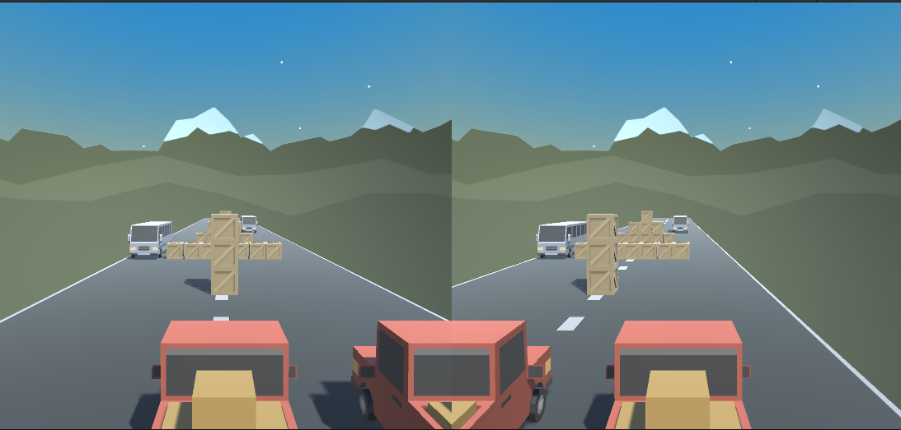
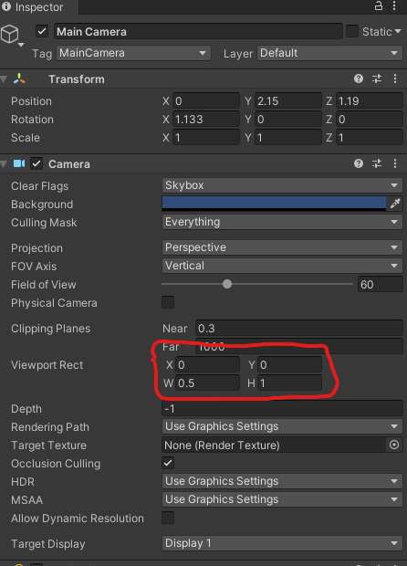
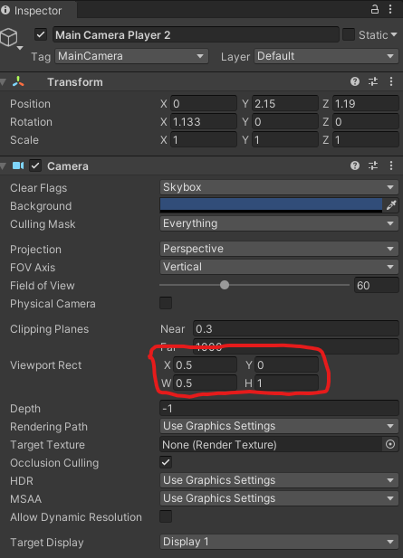

# Two Players spliting screen on Unity

To get this effect on your game you only need to do 2 steps.



1. You need to resize your main camera

1. Instantiate a new camera to go to ther other side of the main camera

## You need to resize your main camera

Change the width size of the Viewport Rect from your main camera to `0.5` as the image bellow:




## Instantiate a new camera to go to ther other side of the main camera

Instantiate a new Camera and set the x position of the viewport rect to 0.5 and width to 0.5. That means that the camera will appear in the 0.5 with width 0.5. As the image bellow:



## Create a script to follow the correct player

Create a new C# script and attach to the camera and set the correct player in the inspector.

```csharp
public class FollowPlayer : MonoBehaviour
{
    public GameObject player;    
    
    private void LateUpdate()
    {
            //Set camera position to player position + offset
            transform.position = player.transform.position;
    }
}
```

This will make the camera follow the correct player.

